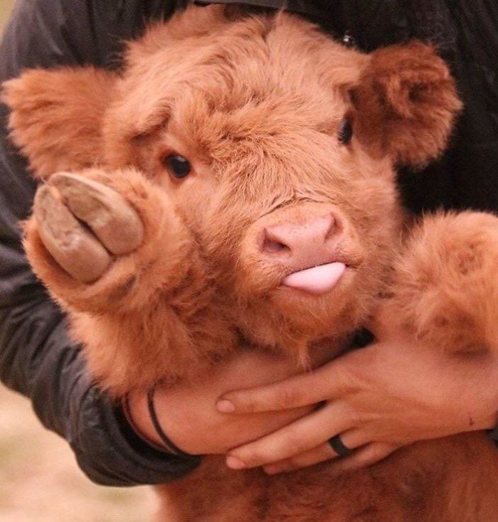

# Creative Coding: Python (Spring 2025)
this repo is where i store my projects made in creative coding: python

## what i am learning in this class/ what i made in this class
- data visualization 
- live coding 
- python drawing 

[my github](https://github.com/leik818)

<!--  -->
