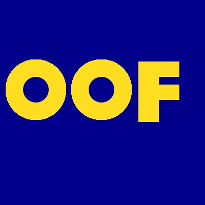

# Creative Coding: Python (Spring 2025)
this repo is where i store my projects made in creative coding: python

### resources for learning python
* 📕 [python basics](https://automatetheboringstuff.com/2e/chapter1/) by al sweigart

* 💻 [python basics: expressions and strings](https://github.com/aparrish/rwet/blob/master/expressions-and-strings.ipynb) by allison parrish

* 💻 [python basics: lists and loops](https://github.com/aparrish/progdat/blob/main/lists.ipynb) by allison parrish

* 🎥 [python as fast as possible](https://www.youtube.com/watch?v=VchuKL44s6E) by tech with tim

* 🎥 [python tutorial in 30 minutes (crash course for absolute beginners)](https://www.youtube.com/watch?v=WEm3EUdicDg) by thenewboston

<!-- [my github](https://github.com/leik818) -->

<!--  -->

### assignment 2: 
for this assignment, i recreated edward rucscha's *OOF*, which he completed in 1962. 

### assignment 3: 
for this assignment, i changed the character that is making the shape of the triangles and the width of the postions 

 

### assignment 4:
for this assignment, i was inspired by vera molnar's 1985 piece, *untitled*, by adapting some code from [this site](https://www.101computing.net/vera-molnar-artwork-revisited-using-python/). i changed the number of columns, adjusted the shapes into squares, and made them pink! 

the inspiration: 

my output: 

### assignment 5
for this assignment, i used assets from [opengameart.org](https://opengameart.org/) to make a game where a [little robot](https://opengameart.org/content/pixel-robot) eats [gears](https://opengameart.org/content/gear-pixel-art-32x32) for his breakfast. for fun, i made the [background](https://opengameart.org/content/arcade-carpet-textures) the same pattersn as old arcade carpet, and added a little [background music](https://opengameart.org/content/cute-bytes-ost-cheers-for-starlight). 

this is what the game ended up looking like: 

and here is a close up of the robot :) 

### assignment 6 
for this assignment, i looked at a data set from [opendata.nyc]( https://opendata.cityofnewyork.us/) that has data on [affordable housing production by building](https://data.cityofnewyork.us/Housing-Development/Affordable-Housing-Production-by-Building/hg8x-zxpr/about_data), that count towards the goals of either the *housing new york* or *housing our neighbors* plans. i wanted to see which borough had the most new units built, and how many total units were created under these plans. i was suprised to see how few units were built in staten island! 

### assignment 7 
for this assignment, i tried to scrape images from one of my favorite artists'[wikipedia page](https://en.wikipedia.org/wiki/David_Wojnarowicz). oddly, his page only had one image though! i struggled to get the directory for the images to work, but i think i got there in the end. 

david: 

### assignment 9 
for this assignment, i tried to combine some of the interface layout code and bad ui we went over in class. i edited the phone dial code so that random numbers would pop up instead of the number you actually wanted to press. 
