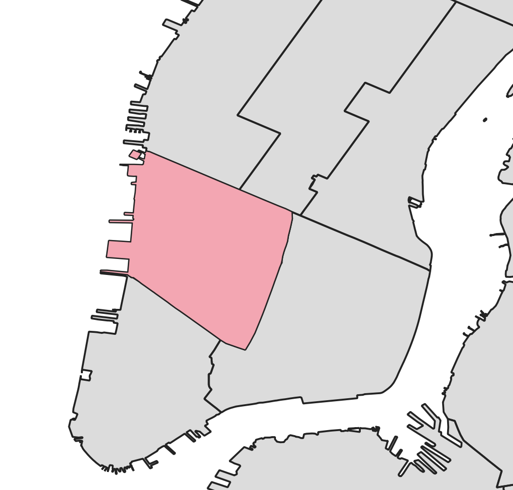
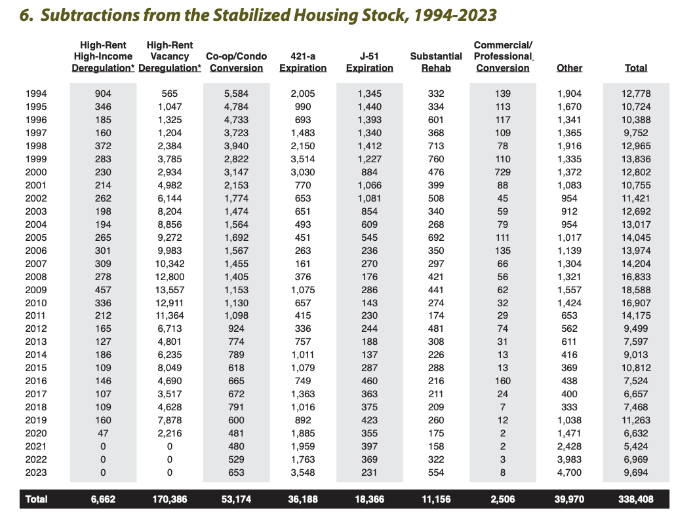
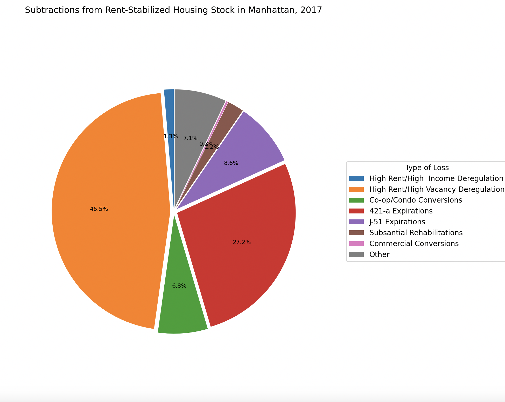
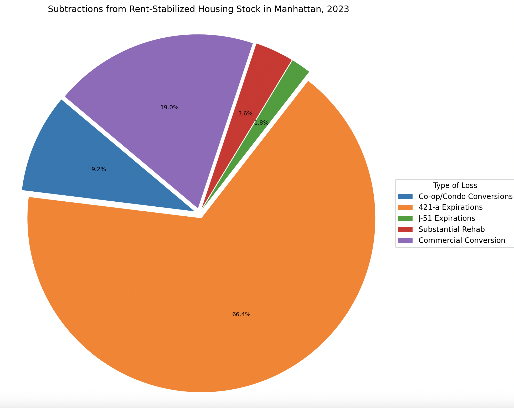
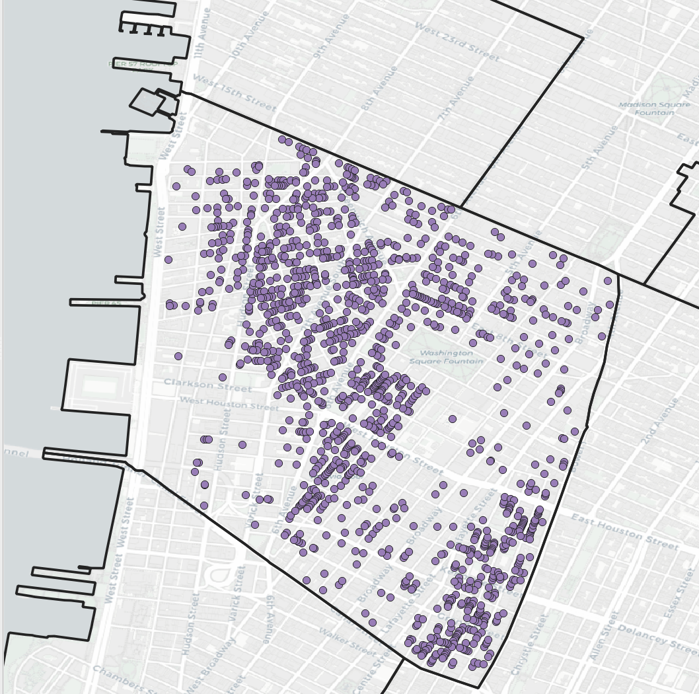
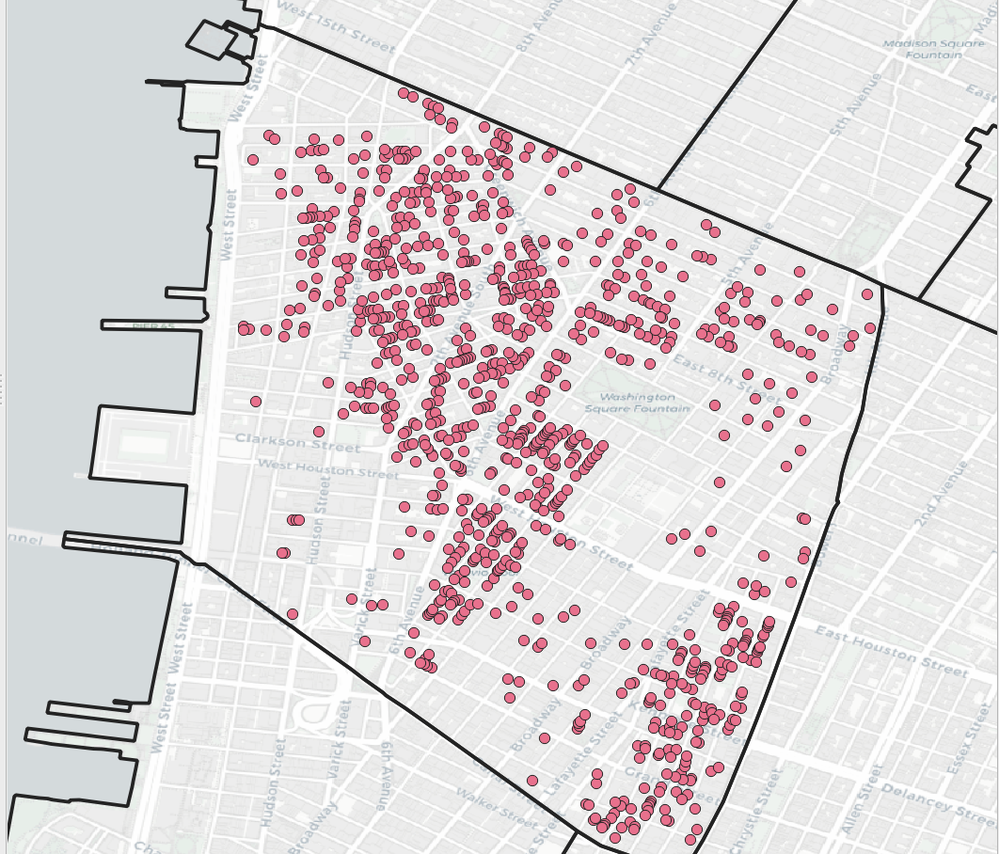
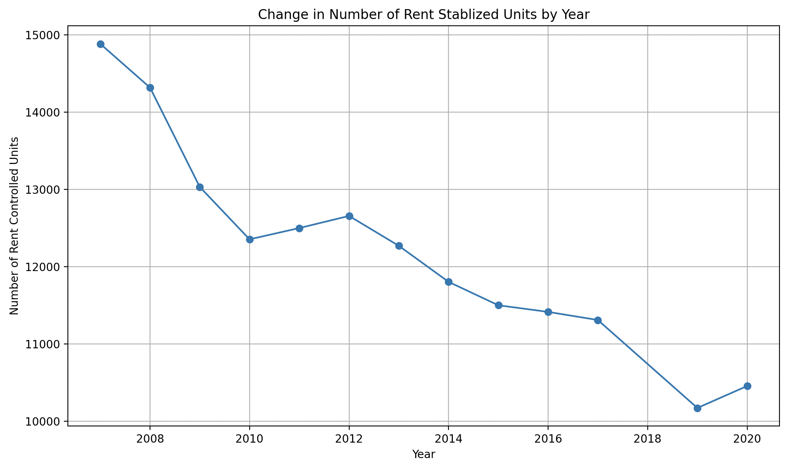

## Final Project: The Past and Present of Affordable Housing in Manhattan Community Board 2

### Introduction 
### *Neighborhood Context* 
Manhattan Community Board 2 is a dynamic and diverse district in Manhattan, bounded by 14th Street, Canal Street, the Bowery/Fourth Avenue, and the Hudson River, encompassing neighborhoods likeGreenwich Village, Little Italy, SoHo, NoHo, Hudson Square, Chinatown, and the Meatpacking District. The area has experienced steady population growth, reaching 92,445 in the 2020 Census, bolstered by students from five major universities whose presence adds to the district's vibrancy. While the community retains its historical, middle-class, and artistic character, economic disparities are growing, with a high median income of $127,116 contrasting with an 8% poverty rate. Housing affordability is a pressing issue, as Community Board 2 has the city’s highest median rent at $2,311, with a significant portion of renters burdened by housing costs. Over the past years, the Statement of District Needs for Community Board 2 has mentioned housing, and specifically affordability, as a key issue for the area and a topic of major concern for both long-term residents and newcomers to the area.

#### *Figure 1: Community Board 2*

### Statement of District Needs
The [FY26 Statement of District Needs for Community Board 2](https://cbmanhattan.cityofnewyork.us/cb2/wp-content/uploads/sites/9/2025/04/FY2026_Statement_MN02-submitted-November-2024.pdf) identifies its three most pressing issues as homelessness, schools, and affordable housing. Affordable housing remains a critical issue, with few available sites for development in CB2. CB2 is committed to preserving existing affordable units by protecting rent-stabilized apartments, live-work artist spaces, and loft law housing, while endorsing policies that prevent tenant displacement and unnecessary upzoning. CB2 places affordable housing at the center of its housing, economic development, and land use priorities. Historically, the Board has strongly advocated for increased city investment in 100% affordable housing, adaptive reuse of existing buildings, and stricter requirements under the Mandatory Inclusionary Housing program to ensure deeper affordability and eliminate loopholes, especially with very few undeveloped parcels remaining in the district. The Board also continues to be a proponent of the preservation and protection of its existing stock of affordable housing, which includes rent-stabilized units, artist live-work spaces, and Mitchell Lama housing, though this stock is steadily declining due to decontrol. 
In response to the ongoing loss of affordable units, CB2 supports anti-displacement policies that restrict upzoning on rent-regulated sites, limit vertical additions that do not yield affordable housing, and require a Certification of No Harassment before redevelopment. The Board also emphasizes the importance of strategic zoning and land use decisions, as seen in the Special Hudson Square District, to balance residential growth with community character and inclusionary housing. These trends highlight the escalating challenges facing affordable housing in CB2, where limited development opportunities, the steady erosion of existing affordable units, and rising displacement pressures underscore the need for a clear understanding of the scale and complexity of the crisis.

### Project Goals and Scoope 
### *Initial Project Proposal* 
The initial proposal for this project was centered around these questions: *How has land use in Manhattan, CB2, evolved over the last twenty years, particularly in terms of residential, commercial, and mixed-use developments? What are the trends in housing types (e.g., market, rent-stabilized, and rent-controlled rentals; co-ops and condos; multi-units; single-family homes), and how have these trends been influenced by factors such as the commercialization of housing stock (e.g. Airbnb, VRBO, etc.), development incentives, and zoning regulations?* Considering the district’s context and identified needs, the availability of relevant data, and the constraints of the project timeline, the scope was refined to concentrate on housing trends within the district, with particular emphasis on affordable housing, which continues to be a central priority.

### *Refined Project Description* 
Given the housing trends in the city, and in light of a historically low vacancy rate of 1.4%, it is clear that citywide, and especially in CB2, affordable housing is a pressing issue. In light of these trends, it becomes critical to investigate the nature, distribution, and trajectory of affordable housing within CB2 in order to better understand the factors contributing to its decline and identify opportunities for preservation and expansion.

Thus, we are guided to answer the following questions:

*Where are affordable housing units located in Manhattan Community Board 2? What patterns emerge when looking at this net loss of units over time? What kind of affordable housing exists in CB2, and how are they funded? What steps can be taken to preserve the current stock of affordable housing units, or create more affordable housing in the district?* 

By understanding the the scope and scale of the loss of affordable housing units, within the context of the overall housing crisis, this project can help inform best next steps within the community board, including areas of policy intervention, possible sites for new housing projects, and providing an explanation of current and past trends in the neighborhoods so many call home.

### Project 
### *Assessment of Rent Stablized Units*
The first part of this project involves assessing the past and current stock of rent stabilized units in the district in order to determine what trends exist, especially concerning the loss of these units over time. By analyzing these trends, this study seeks to provide deeper context for the overall loss of affordable housing in the district, as well as to identify what patterns and factors contributing to the conversion of these units into market-rate stock emerge from the data. 

### *Methodology and Data Sources*
To begin the analysis, I identified buildings containing at least one rent-stabilized unit by drawing on datasets from the New York City Department of Finance and the Department of Housing Preservation and Development. The primary dataset, accessed using [Python-based data scraping methods](https://github.com/paulsalama/nyc-stabilization-unit-counts/tree/2020-update), included tax bill records detailing the number and location of rent-stabilized units within individual buildings. This data was then filtered to focus specifically on properties located within Manhattan Community Board 2. To enhance the accuracy of the analysis, entries showing apparent increases in rent-stabilized units were excluded. Given the nature of the data collection methods, such increases likely reflect administrative errors, inconsistencies in reporting, or other anomalies, rather than genuine growth in affordable housing stock. As a result, the analysis focused exclusively on buildings with a net loss of rent-stabilized units, which are more reliably documented. While the erosion of rent-stabilized housing is particularly visible in CB2, it is emblematic of a broader citywide trend. To situate these local findings within a wider context, additional data from the New York City Rent Guidelines Board was used to examine patterns in affordable housing across the five boroughs.

### *City-Wide Context* 
A key question to understand when identifying trends in affordable housing is not just how many units are being lost or gained over time, but what systemic and policy-driven forces are causing these fluctuations. The most recent report from the Rent Guidelines Board provides critical insight into the mechanisms behind the loss of rent-stabilized units, revealing long-term trends that continue to erode New York City's affordable housing stock. [(Figure 2)](https://rentguidelinesboard.cityofnewyork.us/research/). 

#### *Figure 2: Subtractions from Rent Stablized Housing Stock, 1997-2023 (Rent Guidelines Board)* 
 Chief among these was luxury decontrol.  Luxury decontrol, formally known as high-rent vacancy decontrol and high-income deregulation, was introduced in New York State in the 1990s as part of broader rent regulation reforms. Enacted under the Rent Regulation Reform Act of 1997, the policy allowed landlords to remove apartments from rent stabilization if the rent exceeded a certain threshold and either became vacant or was occupied by tenants earning above a specified income level for two consecutive years. Intended to encourage investment in the rental market and reduce regulation on high-end units, luxury decontrol became a major driver of affordable housing loss over the next two decades. The policy was widely criticized for incentivizing tenant turnover and deregulation in gentrifying neighborhoods. In 2019, the Housing Stability and Tenant Protection Act eliminated luxury decontrol altogether, signaling a shift toward preserving the city’s rent-stabilized housing stock. This practice, along with vacancy decontrol, which permits deregulation of units once tenants vacate, has consistently been the primary cause of unit loss. Before 2019, this was a significant driver of the reduction of rent stabilized units [(Figure 3)](https://rentguidelinesboard.cityofnewyork.us/wp-content/uploads/2023/05/2023-Changes-Report.pdf).

#### *Figure 3: Subtractions from Rent Stabilized Units, 2017* 

  Additionally, the expiration of 421-a tax benefits, a program initially designed to incentivize the development of affordable housing, has led to thousands of units reverting to market rate once compliance periods end. After 2019, this became the most significant reason units were removed from rent stabilization [(Figure 4)](https://rentguidelinesboard.cityofnewyork.us/wp-content/uploads/2023/05/2023-Changes-Report.pdf).
  
  

  #### *Figure 4: Subtractions from Rent Stabilized Units, 2023* 
  
   These policy loopholes and expirations demonstrate how rent-stabilized housing is not merely being lost through neglect or redevelopment, but through structured mechanisms embedded in the city’s housing laws and incentives.
   Overall, it is clear that the loss of rent-stabilized units has become a systemic and pervasive issue not limited to Community Board 2, but evident across the five boroughs. Year after year, destabilization outpaces the creation of new regulated units, undermining the city’s stated goals of housing equity and affordability. For example, in 2023 the city saw an addition of 5, 524 rent stabilized units, but a loss of 9, 694 units for a total loss of 4,170 units in just one year. While some additions to the rent-stabilized housing stock do occur, often through legal settlements, rezoning agreements, or the inclusionary housing program, clearly these gains are relatively minimal and insufficient to counterbalance the overwhelming rate of loss. This pattern is not an anomaly; it has been consistent in every annual Rent Guidelines Board report for the past decade, pointing to the urgent need for policy reform. The city has been continuing on a trajectory where affordability becomes increasingly scarce, displacing long-term residents and altering the social fabric of communities like those in CB2.

### *Changes in Community Board 2* 
From 2007 to 2022, the majority of buildings containing rent-stabilized units in Manhattan Community Board 2 experienced a measurable decline in such units, as illustrated in the maps below. Figure 5a displays all buildings that contained at least one rent-stabilized unit in 2007, while Figure 5b highlights those that lost at least one rent-stabilized unit during the 15-year period. These spatial patterns demonstrate that the broader citywide trend of affordable housing erosion is also firmly evident within CB2, further intensifying the district’s ongoing affordability challenges. This loss does not represent isolated instances but rather a persistent and widespread shift, with rent-stabilized units steadily transitioning to market-rate status across a substantial share of the district’s residential buildings

    

   #### *Figure 5a: SAny building with at least one rent stabilized unit (2007) Figure 5b: Any building that lost at least one rent stabilized unit (2007-2020)*

This loss reflects not isolated cases, but a consistent trend of rent-stabilized units steadily converting to market-rate housing across most apartment buildings containing this type of rent regulated housing throughout the district.  In 2007, the average number of rent stabilized units in a building in CB2 was 12, but in 2022, it was down to just 5 units. On average, over this time period, buildings lost 6 rent stabilized units, which would typically make up half of the units in the buildings. CB2 saw a net loss of 4,432 rent stabilized units, which is most likely an underestimation due to the issues with the data around additions of rent stabilized units. More likely, this number is closer to a total loss of at least 6,407 units over this time period. 

  

#### *Figure 6: Changes in Number of Rent Stablized Units by Year* 

### Assessment of City-Owned Land 
### *Methodology and Data Sources* 

The data used in this section of the project were obtained from NYC Open Data and filtered to focus specifically on Manhattan Community Board 2. The primary sources include the Affordable Housing Projects database, the [Owned and Leased Property](https://data.cityofnewyork.us/City-Government/City-Owned-and-Leased-Property-COLP-Geodatabase/c2g8-ercv/about_data) dataset, and the [Historic Districts](https://data.cityofnewyork.us/Housing-Development/Historic-Districts/skyk-mpzq/about_data) shapefile, each of which provided the spatial and attribute information relevant to the analysis.

### *Affordable Housing Development in CB2* 
The first phase of this project focused on analyzing current trends in affordable housing, while the final component shifts toward exploring future strategies and interventions. On the map below, the yellow zones represent historic districts, which present additional layers of regulatory and design constraints that are still being assessed for their full impact on housing development potential. The blue dots indicate affordable housing projects completed under the Housing New York Plan (2014–2021) and the more recent Housing Our Neighbors Plan (2022). Notably, these projects are few in number within this district, and all appear to be under 200 units, underscoring the significant challenges in delivering large-scale affordable housing locally. These spatial and policy limitations played a key role in shaping the framework for the next stage of this project, which aims to identify more realistic and context-sensitive pathways for expanding affordability in a constrained development environment.

  

#### *Figure 7: Affordable Housing Projects* 

### *City-Owned Land in CB2*
To explore strategies for developing new affordable housing with fewer barriers, we focused on identifying City-owned sites that could potentially be redeveloped. Using data from OpenDataNYC, we mapped all such parcels within the district and began categorizing them based on their current use and feasibility for redevelopment. The goal was to distinguish between parcels that were clearly unavailable, those with uncertain development status, and those that might offer real potential for future housing. Later, we refined the categorization framework to make it more accurate and analytically useful.
Sites already serving essential public functions—such as parks, schools, or playgrounds—were considered unsuitable for housing and excluded from consideration. Another category included vacant or seemingly underutilized properties that, on the surface, appeared to offer opportunities for new housing. However, further investigation sometimes revealed conflicting ownership or existing development plans that made redevelopment unlikely the (e.g. The  only vacant lot owned by the city in CB2 had been sold to a new owner). A third category captured more complex or ambiguous sites—properties where redevelopment might be possible, but would require navigating regulatory hurdles, overlapping uses, or creative design approaches. These distinctions were key to framing the next phase of the project, helping us understand the limited landscape for affordable housing development in this district while highlighting where opportunities—however constrained—might still exist. The broader objective was to assess what data is available and how it might inform long-term planning or advocacy for new affordable housing.

  

 #### *Figure 8: City Owned and Leased Properties* 

 ### *Site Analysis* 
 An in-depth analysis of city-owned properties within Manhattan Community Board 2 highlights the significant spatial constraints that limit opportunities for new development, particularly for affordable housing. Unlike many other areas in New York City, CB2 is a largely built-out district with few vacant parcels of land. Among those that do exist, only a small number are publicly owned, further restricting options for municipally-led development initiatives.
Initial mapping and review of available sites suggested some potential locations for redevelopment. However, upon closer examination, many of these parcels are already allocated for existing municipal functions, such as public safety or transit infrastructure, and are therefore unavailable for housing development in the near term. These findings underscore the unique challenges faced by CB2, where physical availability of land—not just zoning or financing—is a primary barrier to expanding the affordable housing stock.

In light of these constraints, any effort to leverage city-owned land in CB2 will require creative and adaptive approaches. For example, certain properties currently used for non-residential purposes could be reimagined to serve dual functions. One possibility might involve converting an FDNY parking lot into a mixed-use development that maintains emergency vehicle access while introducing residential units above. Another example could involve relocating a surface-level transit substation underground to allow new construction on the freed-up surface space. While these proposals would require complex planning, interagency collaboration, and potentially extended timelines, they demonstrate how underutilized public land could be more strategically activated to address the district’s housing needs.

Importantly, these types of long-term solutions align with CB2’s ongoing commitment to affordability and community-driven development. The board has consistently expressed a willingness to support innovative strategies that reflect the physical realities of the district while advancing equity and access in housing. As such, future efforts to expand affordable housing in CB2 may depend not only on identifying available land but also on embracing creative, context-sensitive planning approaches that make the most of limited urban space.

### Conclusion
This report has examined the past, present, and future of affordable housing in Manhattan Community Board 2 through a combination of spatial analysis, historical policy review, and evaluation of city-owned land. The findings clearly demonstrate that CB2 is not exempt from the broader housing challenges facing New York City, particularly the loss of rent-stabilized units, limited development capacity, and increasing affordability pressures on residents.
From 2007 to 2022, the district experienced a significant net loss of rent-stabilized units, due to the structures of policies such as luxury decontrol and expiring tax incentives. The overall pattern remains one of steady erosion, and this reduction has direct implications for housing equity, stability, and access in CB2, especially as the district grapples with some of the highest housing costs in the city.

Efforts to identify opportunities for new affordable housing development face substantial constraints. CB2’s built-out landscape, combined with a scarcity of city-owned vacant land and the regulatory complexity introduced by historic districts and existing infrastructure, makes large-scale projects difficult. However, this does not render action impossible. Instead, it necessitates a more strategic and creative approach to development that emphasizes adaptive reuse, incremental development, and could require coordination among agencies.

There are many areas for further research in this topic area. While some of the original project questions have been answered, there are other land-use and housing trends that could be explored, such as the effect of short-term rentals through Airbnb on affordability, or the potential to assess buildings that have underutilized FAR that could be built up into more housing projects. The issue of affordable housing is complex, but this work, and any future projects can help add clarity and potentially give direction to how to work towards providing safe and affordable housing to everyone.
In conclusion, addressing the affordable housing crisis in CB2 will require not only identifying and leveraging the few remaining opportunities for development but also ensuring that any future projects include robust, long-term affordability protections. While the physical and regulatory limitations of the district present real challenges, they also underscore the importance of thoughtful, context-sensitive solutions. Preserving what affordable housing remains—and building new units that are genuinely and permanently affordable—will be essential to maintaining the district’s social diversity, economic accessibility, and long-standing character.

